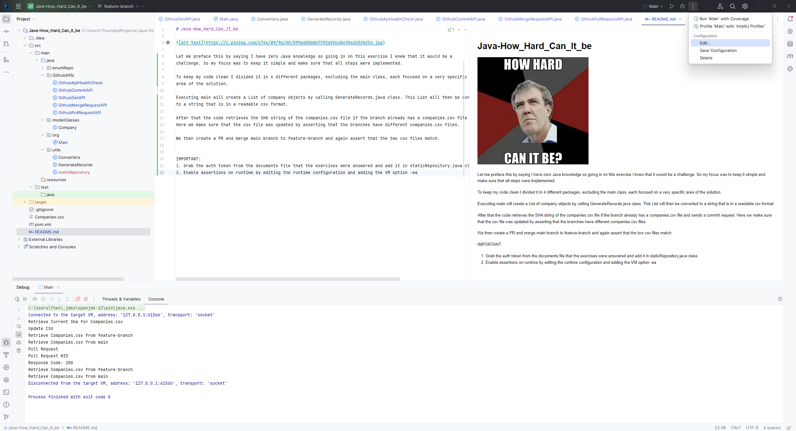
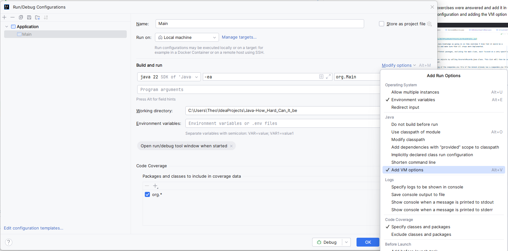

# Java-How_Hard_Can_It_be

Let me preface this by saying I have zero Java knowledge so going in on this exercise I knew that it would be a
challenge. So my focus was to keep it simple and make sure that all steps were implemented.
 
To keep my code clean I divided it in 4 different packages, excluding the main class, each focused on a very specific
area of the solution. 

Executing main will create a List of company objects by calling GenerateRecords.java class. This List will then be converted
to a string that is in a readable csv format. 

After that the code retrieves the SHA string of the companies.csv file if the branch already has a companies.csv file and sends a commit request. 
Here we make sure that the csv file was updated by asserting that the branches have different companies.csv files. 

We then create a PR and merge main branch to feature-branch and again assert that the two csv files match. 

IMPORTANT:
1. Grab the auth token from the documents file that the exercises were answered and add it in staticRepository.java class
2. Enable assertions on runtime by editing the runtime configuration and adding the VM option -ea

